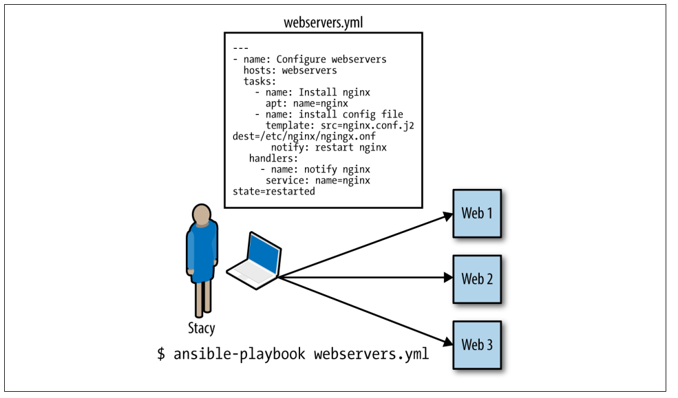

# Ansible !

--> SLIDE 1


Ansible e' un sistema di "configuration management", composto da un "control node" che 
tramite dei "playbooks", applicati contro dei "managed nodes" presenti nell' "inventory",
gli fa eseguire dei compiti.

Gli scopi di questo sistema sono quelli di:
    - eliminare le ripetizioni e semplificare il flusso di lavoro
    - gestire e mantenere la configurazione dei sistemi
    - permettere il deployment di software complesso
    - eseguire "rolling updates" a zero downtime

Include una architettura agentless, tipica dei sistemi RHEL ( podman ), e' estremamente semplice da usare,
flessibile e scalabile, predicibile e ( finalmente ) equipollente.  

Red Hat® Ansible Automation Platform è stato realizzato con gli stessi elementi base della versione di Ansible sviluppata dalla community. La differenza è che offre un supporto completo di livello enterprise durante l'intero ciclo di vita e include caratteristiche progettate per aiutare le organizzazioni a standardizzare, ridimensionare e rendere operativa l'automazione. 

## L’Impatto dell’Infrastructure Automation sugli Operatori IT (DevOps)
L’infrastructure automation rappresenta una delle evoluzioni più significative nel panorama IT degli ultimi anni. Si tratta di un approccio che consente di gestire e configurare infrastrutture IT attraverso codice e strumenti automatizzati, riducendo l’intervento manuale e migliorando l’efficienza complessiva. Per gli operatori IT, in particolare per i team DevOps, questa trasformazione ha avuto un impatto profondo, ridefinendo ruoli, competenze e modalità operative.

### Riduzione delle attività ripetitive
Tradizionalmente, molte attività nell’amministrazione dei sistemi erano manuali, come la configurazione di server, il provisioning delle risorse o il monitoraggio dei sistemi. Con strumenti di automation come Terraform, Ansible, Puppet o Chef, queste attività vengono automatizzate, liberando gli operatori IT da compiti ripetitivi e soggetti a errori. Questo consente ai team DevOps di concentrarsi su attività a maggiore valore aggiunto, come l’ottimizzazione delle architetture o lo sviluppo di nuove funzionalità.

### Accelerazione dei processi DevOps
Uno degli obiettivi chiave del DevOps è ridurre i tempi di rilascio del software, migliorando al contempo la qualità delle applicazioni. L’infrastructure automation facilita questo processo, rendendo possibile il provisioning e la configurazione rapida e coerente degli ambienti. Ad esempio, l’utilizzo di script Infrastructure as Code (IaC) permette di creare ambienti di sviluppo, test e produzione identici, eliminando problemi legati a configurazioni incoerenti.

### Crescita delle competenze tecniche
Per gli operatori IT, l’automazione dell’infrastruttura richiede un aggiornamento significativo delle competenze. La padronanza di strumenti come Terraform o Ansible, la conoscenza dei linguaggi di scripting (come Python o YAML) e la comprensione delle architetture cloud sono diventate competenze essenziali. Inoltre, l’approccio DevOps spinge gli operatori IT a collaborare strettamente con i team di sviluppo, acquisendo competenze in settori tradizionalmente separati, come il versionamento del codice o l’integrazione continua.

### Maggiore resilienza e affidabilità
L’automazione consente di implementare configurazioni standardizzate e ripetibili, riducendo la possibilità di errori umani. Questo migliora la resilienza dei sistemi e la loro capacità di recupero in caso di guasti. Inoltre, gli strumenti di automation integrano spesso funzionalità di audit e logging, garantendo una maggiore trasparenza e tracciabilità delle modifiche, un aspetto fondamentale per la compliance e la sicurezza.

### Implicazioni per il ruolo degli operatori IT
L’automazione sta trasformando il ruolo degli operatori IT. In passato, gran parte del lavoro era dedicata al mantenimento e al supporto delle infrastrutture. Oggi, gli operatori IT sono sempre più coinvolti nella progettazione di sistemi scalabili e nell’implementazione di pipeline automatizzate. Il risultato è un ruolo più strategico e orientato all’innovazione.

### Sfide e opportunità
Sebbene l’automazione porti numerosi vantaggi, presenta anche sfide. Gli operatori IT devono affrontare una curva di apprendimento iniziale e la complessità di gestire strumenti eterogenei. Inoltre, l’adozione dell’automazione richiede un cambiamento culturale, in cui il fallimento è considerato parte del processo di miglioramento continuo. Tuttavia, le opportunità sono immense: maggiore efficienza, scalabilità e un ruolo professionale più dinamico e stimolante.

### Conclusione
L’automazione dell’infrastruttura non è solo una tendenza tecnologica, ma una trasformazione che ridefinisce il modo in cui i team IT operano. Per i professionisti DevOps, rappresenta una sfida e un’opportunità unica per evolvere, acquisire nuove competenze e contribuire in modo strategico al successo delle organizzazioni. Il futuro del settore sarà sempre più legato alla capacità di abbracciare l’automazione e di sfruttarla per creare sistemi più resilienti, agili e innovativi.

### Configuriamo l'ambiente

### Installare

    https://learn.microsoft.com/en-us/cpp/windows/latest-supported-vc-redist?view=msvc-170#latest-microsoft-visual-c-redistributable-version
    https://download.virtualbox.org/virtualbox/7.0.18/VirtualBox-7.0.18-162988-Win.exe
    https://developer.hashicorp.com/vagrant/install?product_intent=vagrant
    https://download.mobatek.net/2412024041614011/MobaXterm_Installer_v24.1.zip
    https://winscp.net/download/WinSCP-6.3.5-Setup.exe/download


## Installiamolo su Debian
```
sudo apt install wget gpg
UBUNTU_CODENAME=jammy
wget -O- "https://keyserver.ubuntu.com/pks/lookup?fingerprint=on&op=get&search=0x6125E2A8C77F2818FB7BD15B93C4A3FD7BB9C367" | sudo gpg --dearmour -o /usr/share/keyrings/ansible-archive-keyring.gpg
echo "deb [signed-by=/usr/share/keyrings/ansible-archive-keyring.gpg] http://ppa.launchpad.net/ansible/ansible/ubuntu $UBUNTU_CODENAME main" | sudo tee /etc/apt/sources.list.d/ansible.list
sudo apt update -y && sudo apt install ansible -y
ansible-config init --disabled -t all > /etc/ansible/ansible.cfg_NO
```

### YAML

https://docs.fileformat.com/it/programming/yaml/


## Use case
Abbiamo scritto uno script che configura tre webservers.
In ansible gli script si chiamano `playbook` e le macchine su cui dobbiamo eseguire i nostri scripts 
sono i `remote hosts`.

Diciamo che l'obiettivo dei nostri playbooks sia quello di installare nginx, generare un file di configurazione, copiare i certificati 
di sicurezza e avviare il servizio nginx.

Il tutto verra' eseguito con il comando 
`ansible-playbook webservers.yml`
Ansible creera' una connessione ssh, senza agente e quindi, usando il solo server sshd sulla macchina remota, ed eseguira' in ordine
i task presenti nel playbook 

Il nostro primo task del playbook sara' qualcosa di molto simile:

```
    - name: install nginx
    apt: name=nginx
```

Ansible generera' uno script python che installi il webserver e lo copiera' su tutti e tre i server remoti, lo eseguira' localmente ed
aspettera' che l'esecuzione sia completata. Questo avverra' per ogni task che gli abbiamo detto di eseguire.

Bisogna tenere presente che:

  - Gli script vengono eseguiti in parallelo su tutti gli host remoti,
  - ansible aspetta che un task sia stato completato ( ritorni un exit status ) 
    su tutte le macchine
  - ansible rispetta la sequenza dei task impostata dallo sviluppatore

  

## Gli inventory

creiamo le cartelle necessarie

```
mdkir -p ./ansible/inventory ./ansible/playbooks ./ansible/roles
```

```
--> .ini

cat > /etc/ansible/hosts << EOF
[test]
remote_host ansible_ssh_host=10.0.0.12 ansible_ssh_port=22
EOF

--> yaml
cat > /etc/ansible/hosts << EOF
myhosts:
  hosts:
    remote_host:
      ansible_host: 10.0.0.12
      ansible_ssh_port: 22
EOF
```

```
ansible-inventory -i /etc/ansible/hosts --list
ansible myhosts -m ping -i /etc/ansible/hosts
```

Inventory complesso possono essere scritti come segue:

```
leafs:
  hosts:
    leaf01:
      ansible_host: 192.0.2.100
    leaf02:
      ansible_host: 192.0.2.110

spines:
  hosts:
    spine01:
      ansible_host: 192.0.2.120
    spine02:
      ansible_host: 192.0.2.130

network:
  children:
    leafs:
    spines:

webservers:
  hosts:
    webserver01:
      ansible_host: 192.0.2.140
    webserver02:
      ansible_host: 192.0.2.150

datacenter:
  children:
    network:
    webservers:
```

Testiamo la nostra configurazione:
`ansible test -i /etc/ansible/hosts -m ping -vvvvv`


## Organizzazione di un Delivery tramite il File ansible.cfg
Il file ansible.cfg è uno degli elementi centrali per configurare e organizzare un delivery efficace con Ansible. È un file di configurazione che consente di personalizzare e ottimizzare il comportamento di Ansible durante l'esecuzione dei playbook e delle attività automatizzate. La sua corretta configurazione è fondamentale per gestire ambienti complessi e migliorare l'efficienza operativa.

Ecco come è strutturato e utilizzato il file ansible.cfg per organizzare un delivery:

1. Struttura del File ansible.cfg
Il file ansible.cfg è diviso in sezioni predefinite, ognuna dedicata a un particolare aspetto del funzionamento di Ansible. Alcune delle sezioni più comuni includono:

[defaults]
Questa è la sezione principale per le impostazioni generali. Contiene configurazioni che si applicano a tutte le operazioni di Ansible, a meno che non siano sovrascritte in specifiche attività o playbook.

Esempio:
```
[defaults]
inventory = ./inventory/hosts.ini
remote_user = ansible_user
private_key_file = ~/.ssh/id_rsa
host_key_checking = False
retry_files_enabled = False
forks = 10
```
inventory: Specifica il file di inventario utilizzato.
remote_user: L'utente remoto predefinito per le connessioni.
private_key_file: Percorso della chiave privata SSH.
host_key_checking: Disabilita il controllo della chiave host per evitare errori in ambienti dinamici.
retry_files_enabled: Disattiva la creazione di file .retry (utile per evitare confusione nei workflow CI/CD).
forks: Numero di processi paralleli che Ansible può eseguire.
[inventory]
Configura il comportamento dell'inventario.
```
[inventory]
enable_plugins = yaml, ini, script
```
enable_plugins: Specifica i plugin di inventario abilitati, come YAML o script dinamici.
[privilege_escalation]
Definisce le impostazioni per l'escalation dei privilegi (ad esempio sudo).
```
[privilege_escalation]
become = True
become_method = sudo
become_user = root
become_ask_pass = False
```
become: Abilita l’uso di sudo o altri metodi di escalation.
become_method: Metodo di escalation (es. sudo, su).
become_user: Utente di destinazione per l’escalation.
[ssh_connection]
Configura le impostazioni per la connessione SSH.
```
[ssh_connection]
pipelining = True
ssh_args = -o ControlMaster=auto -o ControlPersist=60s
```
pipelining: Migliora le prestazioni riducendo i comandi SSH eseguiti separatamente.
ssh_args: Specifica opzioni avanzate per le connessioni SSH.
[callback_plugins]
Consente di configurare plugin per la visualizzazione e il logging.
```
[callback_plugins]
stdout_callback = yaml
```
2. Organizzazione del Delivery
Per organizzare un delivery efficiente, il file ansible.cfg deve essere integrato in una struttura di progetto coerente. Un esempio di struttura potrebbe essere:
```
project/
├── ansible.cfg
├── inventory/
│   ├── hosts.ini
│   ├── group_vars/
│   │   └── all.yml
│   └── host_vars/
│       └── server1.yml
├── playbooks/
│   ├── deploy.yml
│   ├── update.yml
│   └── rollback.yml
├── roles/
│   ├── webserver/
│   │   ├── tasks/
│   │   │   └── main.yml
│   │   ├── templates/
│   │   │   └── nginx.conf.j2
│   │   └── vars/
│   │       └── main.yml
│   └── database/
└── files/
    └── app.war
```
Centralizzazione delle Configurazioni: Collocare il file ansible.cfg nella directory principale del progetto per applicare le configurazioni a tutti i playbook e ruoli.
Gestione delle Variabili: Usare group_vars e host_vars per definire variabili specifiche per gruppi o host.
Separazione dei Ruoli: Organizzare i ruoli in directory dedicate per facilitare il riutilizzo e la modularità.

3. Best Practices
Versionamento: Includere il file ansible.cfg nel controllo di versione (es. Git) per garantire consistenza tra gli ambienti.
Sicurezza: Evitare di memorizzare credenziali sensibili nel file; utilizzare strumenti come Ansible Vault.
Ottimizzazione: Abilitare pipelining e aumentare il valore di forks per migliorare le prestazioni.
Personalizzazione: Configurare plugin di callback e log per una migliore visibilità dei processi.
Un file ansible.cfg ben configurato è essenziale per un delivery efficiente, riducendo errori e migliorando la scalabilità delle operazioni.

Consideriamo pero' che il .cfg puo' essere posizionato, per motivi diversi, in posizioni diverse.
Automaticamente Ansible lo cerchera':
1. nella posizione speficicata dalla variabile d'ambiente ANSIBLE_CONFIG
2. ./ansible.cfg
3. ~/.ansible.cfg
4. /etc/ansible/ansible.cfg

### Le variabili

Le variabili lsi possono applicare ad ogni istanza di "managed nodes", anche i gruppi
```
webservers:
  hosts:
    webserver01:
      ansible_host: 192.0.2.140
      http_port: 80
    webserver02:
      ansible_host: 192.0.2.150
      http_port: 443
  vars:
    ansible_user: my_server_user
```

## I playbooks
### Hello world

```
cat > 
- name: My first play
  hosts: myhosts
  tasks:
   - name: Ping my hosts
     ansible.builtin.ping:

   - name: Print message
     ansible.builtin.debug:
       msg: Hello world
```

```
ansible-playbook -i inventory.ini playbook.yaml
```


## Bibliografia
ansible open source - https://docs.ansible.com/